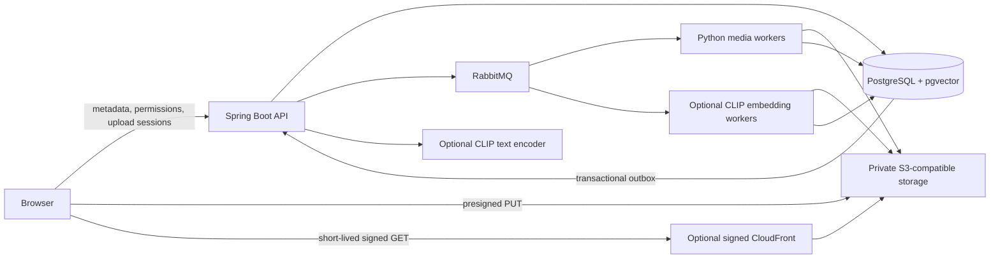

[English](#english) | [简体中文](#简体中文)

<a id="english"></a>

# Generate Cloud / Photoplatform

**Direct Upload · Async Processing · Object Storage · Semantic Search**

A Vue 3 / Spring Boot media platform with private object storage, durable RabbitMQ processing, independently scalable Python workers, and optional CLIP / pgvector retrieval. Public galleries, personal libraries, team membership, moderation, and WebSocket collaboration remain part of the product.

Implementation and verification are separate: see [validation evidence](docs/validation.md), [deployment and operations](docs/cloud-upgrade.md), and the [benchmark harnesses](benchmarks/). Cloud deployment, CDN behavior, and retrieval quality require their own environment-specific checks.

## Architecture



## Run locally

```bash
docker compose up -d --build
# Increase media-processing concurrency independently of the API:
docker compose up -d --scale worker=4
```

Open [localhost:5173](http://localhost:5173); the API is at [localhost:8081](http://localhost:8081). Host ports bind to loopback. The default demo seeds `avery@generatecloud.local / creator123` and `admin@generatecloud.local / admin123`; seeding is disabled by the application and production Blueprint defaults. Keep this demo stack local. `docker compose stop` preserves volumes; `docker compose down -v` deletes them.

PostgreSQL 16 includes pgvector even when ML services are disabled. MinIO uses a pinned Quay release; RabbitMQ and the lightweight media worker start in the default stack. The optional search profile downloads substantially larger ML dependencies and model weights:

```bash
SEMANTIC_SEARCH_ENABLED=true docker compose --profile search up -d --build
```

Wait for `encoder` health before semantic queries. Set the same `SEMANTIC_SEARCH_ENABLED` value on both API and media worker: the API exposes search and the media worker enqueues embeddings. Existing ready images are not automatically re-encoded when this flag changes.

## Upload architecture

The browser computes SHA-256, creates a session using `POST /api/uploads` with a UUID `Idempotency-Key`, and uploads the binary directly using the returned URL and headers. Requests include filename, MIME, size, checksum, title, visibility, and optional team metadata. `POST /api/uploads/{uploadId}/complete` checks ownership, expiry, current team membership, object size, MIME, and signed session metadata; it atomically saves `PROCESSING`, a job, and an outbox row. It does not decode images in the HTTP request.

`GET /api/uploads/{uploadId}` reports processing and embedding states; `DELETE` cancels an uncompleted session. Signed PUTs include `If-None-Match: *` and SHA-256 checksum headers. Storage must support these semantics; the worker independently checks bytes and decoded format. The default upload limit is 15 MiB and 20 active sessions per account. Staging cleanup runs after the URL expires, with a grace period.

## Media processing pipeline

The worker validates bounded image decoding, applies EXIF orientation, calculates SHA-256 and pHash, and writes the original plus WebP previews with maximum edges of 256, 512, 1024, and 1920 pixels. Animated images use their first frame for previews and search. Preview metadata omits GPS and arbitrary EXIF; the original is preserved byte-for-byte and can still contain EXIF.

Processing (`UPLOADING → PROCESSING → READY / FAILED`) is separate from moderation and embedding status. `READY` alone never permits public access. Embedding failures leave successfully processed media viewable. Cancellation and deletion have explicit `ABORTED`, `DELETING`, and `DELETED` states.

## Storage model

Existing numeric image IDs and legacy file locations survive Flyway migrations. New `upload_sessions`, `media_processing_jobs`, `media_outbox`, `media_variants`, and `media_embeddings` tables extend the existing `image_assets` model.

```text
<STORAGE_PREFIX>/staging/<upload UUID>/original
<STORAGE_PREFIX>/media/<mediaId>/v<assetVersion>/media-v1/original
<STORAGE_PREFIX>/media/<mediaId>/v<assetVersion>/media-v1/thumbnail.webp
<STORAGE_PREFIX>/media/<mediaId>/v<assetVersion>/media-v1/small.webp
<STORAGE_PREFIX>/media/<mediaId>/v<assetVersion>/media-v1/medium.webp
<STORAGE_PREFIX>/media/<mediaId>/v<assetVersion>/media-v1/large.webp
```

The prefix defaults to `generate-cloud`; keep it identical across services and infrastructure. Object keys do not expose uploaded filenames. A new asset/pipeline version needs a new path; do not overwrite previously served content. Legacy assets continue through their authenticated backend media path and are not automatically converted or embedded.

## Public/private access and CDN

`GET /api/files/{imageId}/url?variant=medium` checks permissions and returns a 60-second signed URL. The URL response and redirects are `private, no-store`; full API access tokens are never placed in image URLs. Private, team, and pending images use signed S3 URLs with `private, no-store`. Only `PUBLIC + APPROVED + READY` images can receive signed CDN URLs.

The optional [AWS sample](infra/aws/main.tf) keeps S3 private, restricts the origin to CloudFront, and requires viewer signatures on the entire distribution. Public edge objects can remain immutable while the sample caps browser freshness at 60 seconds. An already issued URL and downloaded copy cannot be instantly revoked. Do not add an unsigned CDN behavior: knowledge of an object path must not bypass application authorization.

## Semantic search and duplicates

`GET /api/search?q=yellow%20sports%20car&mode=hybrid&scope=public` supports `keyword`, `semantic`, and `hybrid` modes. Scopes are `public`, `accessible`, `mine`, and `team` (with `teamId`). Both lexical and vector branches apply SQL access restrictions before ranking, including moderation, owner, team membership, readiness, and deletion checks. Admin access is explicit.

The optional encoder uses normalized 512-dimensional CLIP ViT-B/32 embeddings tagged `clip-vit-b32-openai-v1`. Exact cosine search in pgvector supplies the initial recall baseline. English PostgreSQL full-text search ranks title, description, category, and tags; hybrid ranking combines the top 100 candidates from each branch using reciprocal rank fusion, `1 / (60 + rank)`. This avoids claiming arbitrary mixed-score weights are optimal. Keyword search remains available when ML is disabled.

`GET /api/images/{imageId}/duplicates?distance=8` returns accessible SHA-256 matches and pHash candidates with Hamming distance. It is a suggestion, never automatic deletion or shared-file deduplication. A [search evaluation harness](benchmarks/search_eval.py) calculates Recall@5, Recall@10, nDCG@10, and latency for the same labeled queries and permission scope.

## Reliability and retries

The database outbox survives broker outages; publication requires a routed publisher confirmation. Workers use manual acknowledgements, bounded prefetch, durable state, claims, and per-media PostgreSQL advisory locks. Duplicate deliveries reuse unique job/variant identities. Expired leases become eligible for redelivery; processing and deletion share a lock. Hourly reconciliation removes late staging writes and orphan variants after a lost database connection.

Processing/embedding failures retry with backoff, up to three attempts; invalid images fail permanently. Deletion failures continue retrying with a five-minute maximum backoff, and hourly reconciliation recovers deletion jobs dead-lettered by older workers. Terminal jobs remain in the database and are published to `media.dlq`. Owners/admins can replay eligible processing or embedding jobs through `POST /api/images/{id}/retry?type=MEDIA_PROCESS|EMBED`. Operators can use [the replay utility](scripts/replay_job.py), including failed deletion. Once staging has been cleaned, failed media processing requires a new upload.

## Scaling and load benchmarks

[worker_scaling.py](benchmarks/worker_scaling.py) uses an identical deterministic 500-image corpus for 1/2/4-worker trials and records throughput, processing/queue/completion latency, job outcomes, and container CPU/memory samples. [api-load.js](benchmarks/api-load.js) exercises gallery, team, and semantic endpoints; run concurrency levels 20/50/100 against an isolated test stack.

Verified local run: each of 1/2/4 workers completed 500 images with zero failures, at **307 / 315 / 617 images per minute**. On 100 CIFAR-10 test photographs and 50 fixed English queries, Recall@10 was **0.240 keyword / 0.694 semantic / 0.766 hybrid**. These are single-host, small-corpus measurements with class-label proxy relevance, not production capacity or representative product quality. [Validation evidence](docs/validation.md) includes raw data, CPU/RAM, definitions and limitations. [upload-load.js](benchmarks/upload-load.js) separately exercises real concurrent create→storage PUT→complete bursts.

## Observability

```bash
docker compose -f compose.yaml -f compose.observability.yaml up -d --build
```

Grafana is at [localhost:3001](http://localhost:3001), with local demo credentials `admin / local-grafana-password` (override `GRAFANA_PASSWORD`). Provisioned dashboards show upload counters, durable queue depth, throughput, processing/storage/search p95, dead-letter jobs, active jobs, queue wait, and end-to-end latency. Prometheus discovers scaled worker replicas by DNS. OpenTelemetry connects API/database/storage activity with worker traces through the outbox's trace context and exports to Tempo.

The API readiness endpoint is `/readyz`. Actuator/Prometheus runs on internal port `9091`; worker metrics use internal `9100`. These ports are not published by Compose. Queue depth reflects durable database job state, not RabbitMQ message count. [Operational details](docs/cloud-upgrade.md#observability-and-recovery) explain metric boundaries and recovery.

## Deployment and verification

[render.yaml](render.yaml) describes a static frontend, API, independent media worker, and private-network PostgreSQL 16. Supply an external managed RabbitMQ broker and private S3 bucket; optional ML services and CDN are documented separately. The manifest is a deployment template, not evidence of a deployed service. [Deployment guidance](docs/cloud-upgrade.md) covers TLS, CORS, signed upload headers, migrations, access policy, backups, and restore.

```bash
(cd backend && ./gradlew test)
(cd frontend && npm ci && npm run build && npm test)
# Install worker/requirements.txt in an isolated Python 3.12 environment first:
(cd worker && python -m unittest discover -s tests)
```

Use the isolated real-service [integration suite](scripts/integration_test.py) as described in [validation evidence](docs/validation.md). Legacy H2 tests do not validate PostgreSQL migrations, RabbitMQ, S3 signatures, or vector SQL.

## Limitations

No cloud resources are provisioned by a local build. S3-compatible providers must be tested for conditional PUT/checksum, signed response headers, and CORS support. Processing is single-job per worker, uploads are single PUTs, exact vector search is intentionally unindexed, and English CLIP/full-text search is the initial language baseline. No automatic historical backfill, antivirus scan, AVIF generation, or measured cloud CDN hit ratio is claimed. Revocation, original-file metadata, versioned bucket erasure, and rollback limitations are detailed in the deployment guide.

---

<a id="简体中文"></a>

# Generate Cloud / Photoplatform

**对象存储直传 · 异步处理 · 私有对象存储 · 语义搜索**

基于 Vue 3、Spring Boot、PostgreSQL 的图片平台，新增 RabbitMQ 持久化任务、可独立扩容的 Python worker，以及可选的 CLIP / pgvector 检索。保留公共图库、个人空间、团队权限、审核和 WebSocket 协作。

实现与验证分别记录：[验证证据](docs/validation.md)、[部署与运维](docs/cloud-upgrade.md)、[性能测试工具](benchmarks/)。本地构建通过不等于云部署、CDN 或搜索效果已经验证。

## 架构与运行

浏览器向 API 请求上传会话，直接将文件 PUT 到私有对象存储；API 在数据库事务中写入任务和 outbox，再发布到 RabbitMQ。媒体 worker 生成变体并写回数据库；可选 embedding worker 和文本 encoder 使用同一 CLIP 模型。

```bash
docker compose up -d --build
docker compose up -d --scale worker=4
# 可选：同时启用 API 搜索和 worker 的 embedding 任务生成
SEMANTIC_SEARCH_ENABLED=true docker compose --profile search up -d --build
```

前端 [localhost:5173](http://localhost:5173)，API [localhost:8081](http://localhost:8081)。默认本机演示账号为 `avery@generatecloud.local / creator123`，管理员为 `admin@generatecloud.local / admin123`。端口仅绑定本机；不要把演示配置暴露到公网。`docker compose stop` 保留数据，`docker compose down -v` 删除数据卷。搜索首次启动需要下载较大的依赖和模型，等待 encoder 健康检查通过。

## 上传架构与处理流程

前端计算 SHA-256，携带 UUID `Idempotency-Key` 调用 `POST /api/uploads`，使用返回的 URL 与完整签名 headers 直传。`POST /api/uploads/{uploadId}/complete` 校验所属用户、有效期、当前团队权限、对象大小、类型和会话标记，并在同一事务写入处理状态、任务与 outbox。默认上限为 15 MiB，每用户最多 20 个活动上传。

签名上传包含 `If-None-Match: *` 与 SHA-256 checksum，worker 再核对真实内容和解码类型。通过 `GET /api/uploads/{uploadId}` 查看状态，`DELETE` 取消尚未完成的上传；URL 过期并经过缓冲时间后清理 staging。

worker 校验像素上限、修正 EXIF 方向、计算 SHA-256/pHash，保留原始字节，并生成最大边长为 256/512/1024/1920 的 WebP。动画预览使用首帧；预览不保留 GPS 等 EXIF，原文件仍可能包含这些元数据。处理状态、审核状态与 embedding 状态分开，embedding 失败不影响已经可用的图片。

## 存储模型与迁移

保留现有数字图片 ID 和旧文件路径，通过 Flyway 新增 `upload_sessions`、`media_processing_jobs`、`media_outbox`、`media_variants`、`media_embeddings`。旧图默认 `LEGACY + READY`，不会自动搬迁或生成向量。

新对象采用 `<prefix>/staging/<UUID>/original` 和 `<prefix>/media/<id>/v<version>/media-v1/<variant>`，默认前缀 `generate-cloud`。变体名称为 `original`、`thumbnail.webp`、`small.webp`、`medium.webp`、`large.webp`；路径不暴露上传文件名，内容变化必须使用新版本路径。迁移、备份和恢复步骤见部署文档。

## 公私访问与 CDN

`GET /api/files/{id}/url?variant=medium` 完成权限检查后返回 60 秒 signed URL。私密、团队、待审核文件通过 signed S3 URL 读取，使用 `private, no-store`；只有 `PUBLIC + APPROVED + READY` 可得到 signed CDN URL。API 登录 token 不进入图片 URL。

[AWS 示例](infra/aws/main.tf) 保持 bucket 私有，CloudFront 所有请求都要求签名。边缘缓存保留不可变对象，浏览器缓存时间限制为 60 秒。已签发 URL 和已下载副本无法立即撤销，不能为了公开图片增加不验签的 CDN 行为。

## 语义搜索、混合检索与重复提示

`GET /api/search?q=yellow%20sports%20car&mode=hybrid&scope=public` 支持关键词、语义、混合检索，范围为 `public / accessible / mine / team`（团队需 `teamId`）。两条检索分支都在 SQL 排序前执行可见性、审核、所有者、团队成员、处理和删除状态过滤。

CLIP ViT-B/32 输出带模型版本的 512 维归一化向量，pgvector 使用精确余弦检索。英文全文搜索覆盖标题、描述、分类和标签；混合检索对各分支最多 100 个候选做 RRF，公式为 `1 / (60 + rank)`，尚不宣称优于单独检索。关闭 ML 时关键词搜索继续可用。后期开启搜索不会自动回填旧图。

`GET /api/images/{id}/duplicates?distance=8` 仅提示有权限查看的 SHA-256 相同文件与 pHash 相近图片，返回 Hamming distance，不会自动删除或跨用户共享文件。搜索评测工具支持同一权限范围下的 Recall@5、Recall@10、nDCG@10 和延迟比较。

## 可靠性与重试

outbox 在 broker 故障时保留发布意图，收到路由与 publisher confirm 后才记录发布成功。worker 使用手动 ACK、受限预取、持久化 claim/lease、唯一任务与变体约束、按媒体加锁来处理重复投递。处理与删除共用 PostgreSQL 会话 advisory lock；每小时重新清理迟到的 staging 写入，以及数据库连接中断后可能残留的派生对象。

临时失败退避重试，最多三次；非法图片直接进入终止失败。DLQ 状态持久化在数据库，并发布到 `media.dlq`。所有者/管理员可调用 retry API；运维可用 [replay_job.py](scripts/replay_job.py) 重放，包括失败的删除任务。staging 已清理后必须重新上传原图。

## 扩容、性能与可观测性

本地实测 1/2/4 worker 各处理 500 张图片，均零失败，吞吐约 **307 / 315 / 617 张/分钟**。100 张 CIFAR-10 图片、50 条英文查询的 Recall@10 为 **关键词 0.240 / 语义 0.694 / 混合 0.766**；这是单机小样本验证，不代表生产容量或业务图库效果。

[扩容工具](benchmarks/worker_scaling.py) 对 1/2/4 worker 使用同一批默认 500 张确定性合成 JPEG，记录吞吐、处理/排队/完成延迟、失败、CPU 与内存。[API 负载工具](benchmarks/api-load.js) 覆盖图库、团队、语义搜索，可在隔离环境测 20/50/100 并发。实测值与环境限制见[验证证据](docs/validation.md)，不预设线性扩容或生产容量；检索质量仍需 50–100 条有人工相关性标注的代表性查询。

```bash
docker compose -f compose.yaml -f compose.observability.yaml up -d --build
```

Grafana 位于 [localhost:3001](http://localhost:3001)，本机默认 `admin / local-grafana-password`，可通过 `GRAFANA_PASSWORD` 更改。dashboard 显示上传、数据库任务队列、吞吐、处理/存储/搜索 p95、DLQ、活动任务、排队和端到端延迟；Prometheus 通过 DNS 发现 worker 副本，OpenTelemetry 将 trace 导出到 Tempo。

主端口 `/readyz` 用于就绪检查；Actuator/Prometheus 在内部 `9091`，worker metrics 在内部 `9100`，Compose 不发布这些端口。队列深度是数据库待处理任务数，不等于 RabbitMQ 消息数量。

## 部署、验证与限制

[Render 模板](render.yaml) 包含静态前端、API、独立媒体 worker、私网 PostgreSQL 16，需要自行配置外部托管 RabbitMQ 和私有 S3；ML 和 CDN 另按[部署说明](docs/cloud-upgrade.md)设置，不会因本地构建自动部署。

后端执行 `./gradlew test`；前端执行 `npm ci && npm run build && npm test`；Python 3.12 隔离环境安装 `worker/requirements.txt` 后执行 `(cd worker && python -m unittest discover -s tests)`。真实 PostgreSQL/MinIO/RabbitMQ 集成步骤见验证证据，H2 单测不能代替真实签名和向量 SQL 验证。

当前每 worker 同时处理一个任务，上传为单次 PUT，向量检索使用精确扫描，默认检索语言为英文。S3 兼容服务需验证条件写入、checksum、签名响应头和 CORS 支持；尚无自动历史回填、杀毒扫描、AVIF 或已测云 CDN 命中率。已下载副本撤销、原图 EXIF、开启版本管理的 bucket 物理清除和回滚限制均见部署文档。
