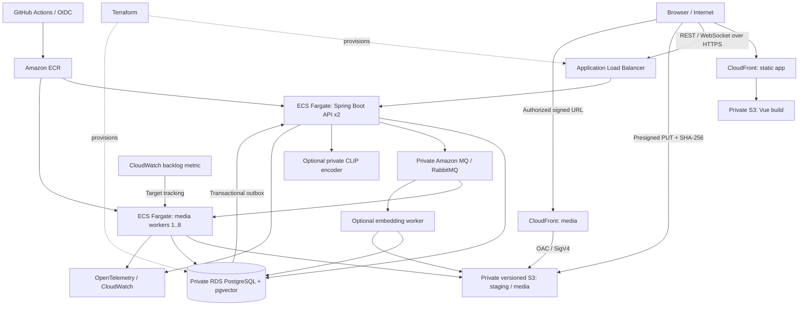

# AWS production-like upgrade

This upgrade keeps the existing product and durable media pipeline. The same API and worker images support local MinIO/RabbitMQ/PostgreSQL and AWS S3/Amazon MQ/RDS. Infrastructure, deployment automation, and executed cloud acceptance are separate deliverables. This is a production-like learning environment, not a production availability claim.

## Deployment topology

The static app and media use separate CloudFront distributions so SPA error handling and unsigned frontend assets cannot weaken media access. All media behaviors require viewer signatures. All authorized versioned images use the media CDN when it is configured, with `private, no-store` browser responses. Only public, approved, ready images permit anonymous authorization; private/team/pending images require the appropriate account. Without CDN configuration, the same authorization precedes signed S3 delivery. Knowledge of a private object key never grants anonymous access.

## Start with the environment contract

- Local: `docker compose up --build -d --wait`; the checked-in Compose configuration selects `STORAGE_PROVIDER=minio` and provides local credentials/endpoints.
- AWS API: `SPRING_PROFILES_ACTIVE=aws` selects production infrastructure defaults, task-role S3 credentials, TLS broker configuration, and external database configuration. Terraform injects application secrets from Secrets Manager.
- AWS workers: task-role credentials and regional S3 endpoints; TLS broker/database connections; durable leases and manual acknowledgements remain the recovery boundary.
- Frontend: `VITE_API_BASE_URL` is a build-time HTTPS API origin. Neither signing keys nor application/backend credentials belong in the frontend bundle.

Keep `STORAGE_PREFIX` identical across the API, all workers, and Terraform. Existing object paths and tables are preserved. New deployments keep versioned media keys (`<prefix>/media/<id>/v<version>/media-v1/...`) to avoid breaking existing records; a cosmetic folder rename is not a data migration.

Use [the infrastructure guide](../infra/README.md) for required inputs, bootstrap, plan/apply, and teardown, and [the deployment guide](../.github/AWS_DEPLOYMENT.md) for repository environment variables and OIDC. Never run a second Terraform root against a bucket already managed by the legacy `infra/aws` example; move/import its state explicitly or choose a separate environment.

## Acceptance matrix for this roadmap

The following are gates, not a count of completed cloud phases. The [AWS validation record](aws-validation.md) records only checks actually executed for this revision.

| Phase | Implementation / verification entry point | Required cloud evidence |
|---|---|---|
| 0: boundaries | Storage/media URL/message interfaces, AWS profile, Compose | Same revision passes Compose and starts with AWS configuration |
| 1: S3 | Presigned SHA-256 PUT, completion ownership/MIME/size/idempotency, private versioned bucket and lifecycle | Expiry/checksum/MIME/size/duplicate/authorization tests against actual S3 |
| 2: CloudFront | OAC, trusted viewer key group, API authorization | Raw S3 denial; valid CDN 200; expired CDN 403; pending/deleted access denial |
| 3: RDS | Private DB security group, encryption/backups, pool/TLS configuration, existing vector migration | `vector` version query, migrations, connection/latency/error telemetry and recovery |
| 4: Amazon MQ | Private TLS broker, outbox confirms, worker retry/DLQ/replay | Broker outage accumulation/drain, duplicate delivery, poison message/replay |
| 5: Fargate | Separate API/media/optional ML ECS services and ECR | Healthy tasks, HTTPS readiness, independently updated API and workers |
| 6: scaling | Worker target tracking and backlog-per-running-task collector | 1/2/4/8-task trials and observed scale-out/scale-in with timestamps |
| 7: IaC | Dev/prod Terraform roots and scoped modules | Plan/apply and teardown in the selected account; retained resources recorded |
| 8: CI/CD | PR verification, OIDC ECR/ECS deployment | GitHub checks plus actual rolling deployment and service health |
| 9: observability | CloudWatch/OTel configuration and existing Prometheus/Grafana | Live API/upload/worker/queue/database/storage dashboard samples |
| 10: failures | [Failure tests](failure-testing.md) | Actual ECS stop, broker/DB interruption, crash boundary and lifecycle evidence |
| 11: vector scale | [Exact/HNSW comparison](../benchmarks/pgvector_comparison.py) | Fixed corpus/query hashes; recall, p50/p95, index/build/resource measurements |
| 12: cloud benchmark | [Cloud benchmark guide](cloud-benchmarks.md) | 20/50/100 users, task scaling, search judgments and cost denominator |

## Reliability boundaries

Presigned URLs are temporary capabilities. Deleting an image or changing moderation denies new URLs immediately after the application transaction; a previously issued CDN URL may remain usable until expiry, and a downloaded copy cannot be recalled. Deletion tests must distinguish new API access, old capability expiry, and physical S3 version erasure. Browser freshness can extend beyond URL expiry for an already downloaded response.

S3 `expiration.days = 1` is an age-based lifecycle rule, rounded to UTC midnight and processed asynchronously. It is not a precise 24-hour scheduler. Versioned buckets also need noncurrent-version expiry and expired-delete-marker cleanup. Application staging reconciliation remains useful for prompt cleanup; lifecycle provides an independent eventual backstop. Completed uploads waiting for processing still reference staging objects, so the configured staging retention also bounds how long a broker/worker outage can recover the original bytes. Set retention to cover the recovery objective and alert on old queued jobs; a durable outbox cannot recreate input bytes already expired by S3. See [AWS lifecycle timing](https://docs.aws.amazon.com/AmazonS3/latest/userguide/intro-lifecycle-rules.html).

The outbox provides at-least-once publication. Worker leases, advisory locks, unique job/variant identities, and deletion reconciliation make repeated delivery recoverable; they do not turn RabbitMQ into an exactly-once transport. Connection retries are bounded and occur outside a partially completed database transaction. Retry the whole durable unit of work, never arbitrary fragments of a transaction.

Queue scaling must count work relevant to the media service, use actual running tasks, and treat missing/stale broker data as unknown. Database queued jobs, broker ready messages, and unacknowledged messages are different quantities; dashboards label each. A failed collector must not publish a synthetic zero that triggers scale-in. Exact pgvector search stays the default until a measured ANN tradeoff warrants changing it.

## Cloud verification and cost

Cloud verification requires a valid AWS identity, a selected region/account, a DNS name/certificate for HTTPS, and the environment inputs described by Terraform. Unit tests and provider schema validation do not validate AWS IAM, regional instance availability, service quotas, CORS, CloudFront edge behavior, or a successful deployment.

Run mutation tests only against a dedicated dev environment. Preserve raw successful/failed attempts, timeout records, corpus/query hashes, commit, instance/task sizes, service versions, start/end timestamps, and configured concurrency. Cost per 1,000 images needs a documented cost window and successful-image denominator; include idle RDS/MQ/ALB/NAT costs and say which costs are allocated. Never substitute local throughput or a price estimate for measured cloud cost.

Before teardown, decide what data must be retained and follow the dev/prod-specific infrastructure instructions. Production deletion protection, snapshots, retained ECR images, log retention, state buckets, and any manually created resources can survive a naive destroy. Confirm the remaining resources in the AWS account after teardown.

## AWS source references

- [CloudFront OAC and private S3 origins](https://docs.aws.amazon.com/AmazonCloudFront/latest/DeveloperGuide/private-content-restricting-access-to-s3.html)
- [RDS PostgreSQL extension versions](https://docs.aws.amazon.com/AmazonRDS/latest/PostgreSQLReleaseNotes/postgresql-extensions.html)
- [Amazon MQ RabbitMQ engine versions](https://docs.aws.amazon.com/amazon-mq/latest/developer-guide/rabbitmq-version-management.html)
- [Amazon MQ RabbitMQ metric definitions](https://docs.aws.amazon.com/amazon-mq/latest/developer-guide/rabbitmq-logging-monitoring.html)
- [ECS queue-based autoscaling](https://docs.aws.amazon.com/AmazonECS/latest/developerguide/service-autoscaling-queue.html) describes the backlog-per-task principle for SQS; this repository adapts it to RabbitMQ with its own measured collector.
