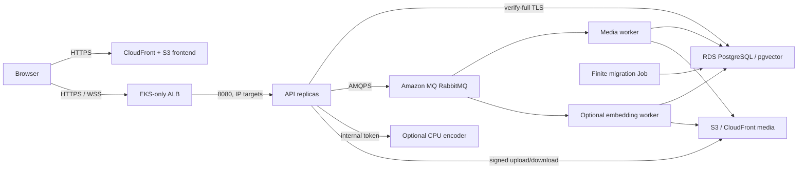

# EKS architecture and ownership

This route was implemented against main `baa6f4bed7e32e52340cf8281e390de1fc15ea76`. That SHA identifies the inspected baseline, not a deployment. Record the final adopted SHA, image digests, chart version, Terraform state serial, regional pins and live cluster ARN in each acceptance run.

`infra/environments/eks-dev` and `eks-prod` each call only `infra/modules/eks`. They do not call the existing all-in-one root. Inputs are inventory-approved IDs and full ARNs, not Terraform remote-state credentials or secret payloads. This avoids granting EKS deployers permission to read the original state, which already contains other sensitive infrastructure configuration.

| Resource | Single owner | EKS interaction |
| --- | --- | --- |
| VPC, routes, NAT/endpoints, public/private/data subnets | Existing dev/prod network state | Read-only IDs; no subnet retagging |
| RDS, MQ, S3, CloudFront | Existing dev/prod platform state | Restricted users/prefixes and TLS endpoints |
| ECR repositories and lifecycle policies | Existing ECS module in original state | Explicit existing repository ARNs; digest images |
| EKS cluster, KMS, nodes, log group, node/control/ALB SG | Independent `eks-dev` / `eks-prod` state | Compute only |
| Three dependency ingress rules from EKS node SG | Independent EKS state | 5432 to DB, 5671/443 to broker; original SG resource stays with original owner |
| EKS AWS access entries and Pod Identity roles | Independent EKS state | Named admin, restricted namespace deployment group, distinct workload roles |
| LBC/CSI/metrics, release RBAC, namespace | Platform bootstrap | Version-pinned admin action from private runner |
| EKS ALB, listeners, target groups | AWS Load Balancer Controller | Dedicated ingress with explicit Terraform-owned frontend SG |
| Application manifests and migration Jobs | Helm/app release | Namespace resources only |
| Existing ECS ALB and production DNS | Original state | No automatic changes |

Only private subnets host EC2 nodes/control-plane ENIs. Node groups span at least two availability zones; topology spread and PDBs protect API placement. `photoplatform.io/workload=application` labels select the default pool; the ML pool has `photoplatform.io/workload=ml:NoSchedule`, and ML pods must select/tolerate it. ML cache belongs to each Pod's ephemeral storage, with an immutable model version and checksum; it is not a shared EBS volume.

The EKS private API is reachable on 443 only from declared runner SGs and nodes. Nodes have no SSH ingress and require IMDSv2 with hop limit 1. The node role has EC2/EKS bootstrap, ECR pull and Pod Identity Agent support, but no application S3 or Secrets Manager grants; CNI permissions belong to `kube-system/aws-node`. EBS root volumes and Kubernetes Secret data are encrypted. Every control-plane log type is retained. Production enables EKS deletion protection; the cluster KMS key has Terraform `prevent_destroy` so retirement cannot silently destroy encrypted-state recovery material.

The ALB can reach only API port 8080. Metrics 9091, workers and encoder have no external Service. Configure ingress with the `alb_security_group_id` output, `manage-backend-security-group-rules=false`, `target-type=ip`, and explicit `public_subnet_ids`; do not use the ECS SG, target group or an unrestricted cross-namespace IngressGroup. This keeps SG-rule ownership out of the controller and prevents it competing with Terraform.

VPC CNI network-policy support is enabled on the selected Linux EC2 path. Initial compute bootstrap uses standard mode until CoreDNS and system policies exist; a reviewed second add-on update enables strict mode before application release. Platform bootstrap grants the necessary system-namespace policy; application namespaces use the Helm policies. Verify real enforcement with allowed and denied test connections. AWS SGs control network reachability, while TLS, IAM, scoped credentials and business authorization remain necessary. A YAML NetworkPolicy by itself is not acceptance evidence.

For the data plane, keep stable direct RDS sessions for worker advisory locks, independent runtime/migrator DB users, AMQPS broker users and a monitoring-only broker identity. Upload processing remains PostgreSQL durable state + at-least-once RabbitMQ delivery + claim fencing and reconciliation. Kubernetes restarts, HPA or node drain do not provide exactly-once behavior.

The frontend stays S3/CloudFront. EKS dev uses an independent API hostname/ACM certificate and allowed browser origin. A DNS record is created only after the controller ALB address is known and verified; this new compute state deliberately does not manage production Route53 records. Follow [resource inventory](resource-inventory.md), [state ownership](terraform-state-migration.md) and [identity](secrets-and-iam.md) before provisioning.
